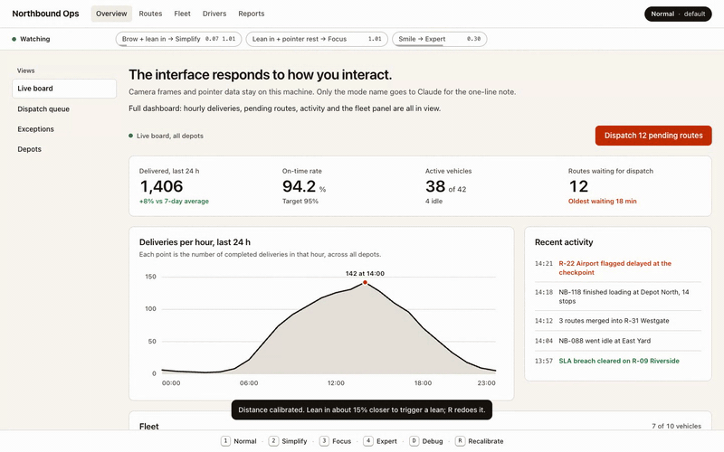
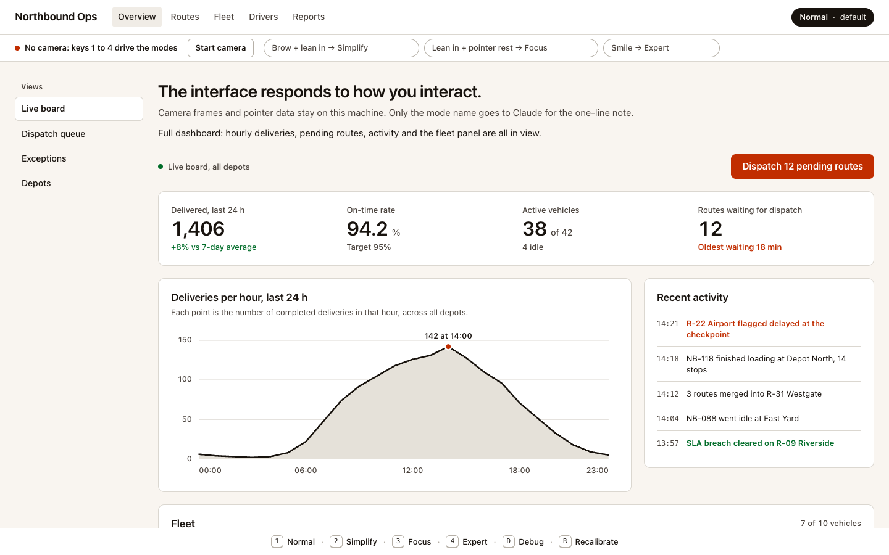
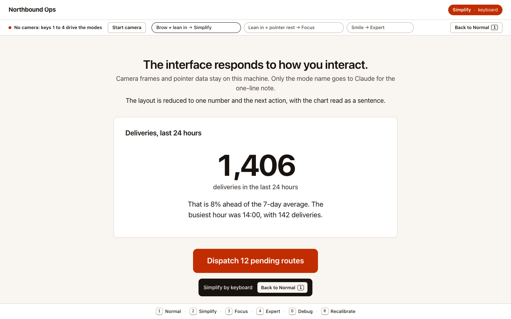
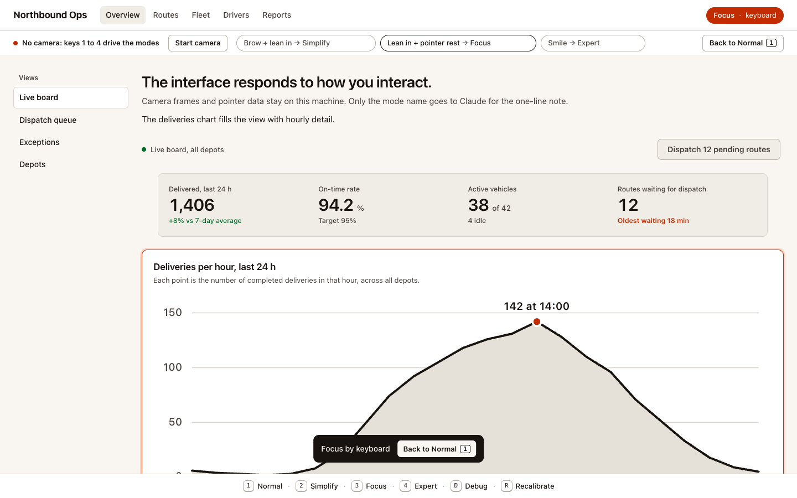
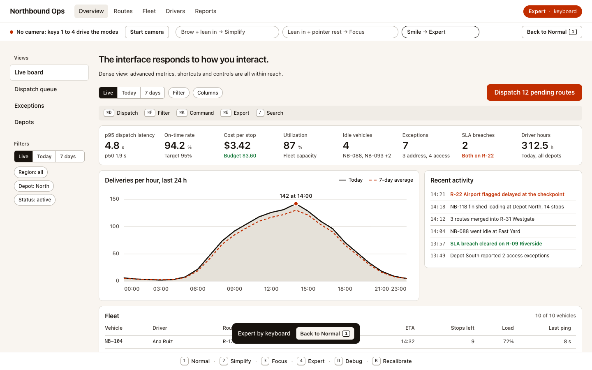

# Adaptive Interface

A dashboard that physically restructures in response to your face and pointer. Decisions are local; Claude writes the words after.



Full clip: [docs/demo.mp4](docs/demo.mp4). Same run with the debug panel open, so the camera preview, the raw signals and the transition reason are on screen: [docs/demo-debug.mp4](docs/demo-debug.mp4) ([gif](docs/demo-debug.gif)).

What the clip shows, honestly: the camera is a looping video of the author's face fed to Chromium as a fake webcam. The Normal to Expert change is driven by the smile in that video (engine reason: "smile 0.81 sustained 900ms"). Simplify and Focus are then triggered by keys 2 and 3, because no clip with a furrowed brow exists yet; on a live camera those two come from the lean plus brow and the lean plus pointer rest.

| | |
|---|---|
|  Normal |  Simplify |
|  Focus |  Expert |

## What it does

An operations dashboard ("Northbound Ops", fictional data) runs in the browser with the camera on. It watches four measurable things about you and changes its own layout:

1. Lean in and furrow your brow: the page drops to one number, one action and the chart read as a sentence (Simplify).
2. Smile and hold it: the page densifies into eight KPIs, a dense chart, shortcuts and controls (Expert).
3. Lean in while the pointer rests on a component: that component comes forward and the rest steps back (Focus).
4. Lean back: the full dashboard returns (Normal).
5. Every change is announced on screen with the reason, and one key (or one button) always brings you back.

The thesis: the interface reacts to physical signals only (blendshape coefficients, face size against a calibrated baseline, head angles, pointer dwell). There is no emotion inference, because a layout that acts on a measured lean or smile can be explained, tested and reversed, while a guess about internal state cannot.

## How it works

```
MediaPipe Face Landmarker (wasm, in the browser)
        |  478 landmarks, 52 blendshapes, 4x4 transform matrix, every frame
        v
Smoothed signals (time-based EMA)          Pointer signals (velocity, dwell target, dwell time)
        |                                                   |
        +------------------------+--------------------------+
                                 v
              Local heuristic state machine (src/engine)
              hysteresis, sustained accumulators, cooldown, spent gestures
                                 |
                                 v
              EngineState.mode -> Framer Motion layout morph (src/ui)
                                 |
                                 v  (after the change, off the critical path)
              POST /api/insight -> Claude writes one line of copy
```

No camera frame leaves the machine. The only thing that goes to Claude is the mode name, the focused component id and a fixed description of the dashboard.

### Signals

| Signal | Source | Used for |
|---|---|---|
| `smile` | mean of blendshapes `mouthSmileLeft`, `mouthSmileRight` | Expert |
| `brow` | mean of blendshapes `browDownLeft`, `browDownRight` | Simplify (with a lean) |
| `browInnerUp` | blendshape `browInnerUp` | debug only, never a mode |
| `faceHeight` | outer eye corners (landmarks 33 to 263) plus forehead top to nose tip (landmarks 10 to 1), each divided by cos(yaw) or cos(pitch) | `proximity` = smoothed `faceHeight` / calibrated baseline |
| `proximity` | above 1 is closer than the baseline, below 1 is farther | lean in (Simplify, Focus), lean back (Normal) |
| `yaw`, `pitch`, `roll` | `facialTransformationMatrixes[0]`, landmark fallback | frontal gate for lean back, foreshortening compensation |
| `presence` | EMA of face found / not found per frame | trust gate, absence timer |
| `dwellTarget`, `dwellMs` | `data-focus-id` under the pointer, re-hit-tested every 200 ms | Focus target |

The size metric deliberately avoids the chin: forehead-to-chin grows about 10% on a smile because the jaw drops, which read as leaning in. Eye span and upper-face height do not move with the mouth.

### Rules against false positives

- Time-based EMA: `alpha = 1 - exp(-dt / tau)`, so smoothing does not depend on frame rate. Tau is 150 ms for brow and smile, 250 ms for face size, 200 ms for angles, 400 ms for presence.
- Hysteresis on every threshold: a signal engages above `on` and only releases below `off`. A value between the two keeps a ramp going but never starts one.
- Sustained accumulators: a gesture must hold for 700 to 1500 ms before it fires. A released gesture drains at twice the rate it filled. A single frame can never switch modes.
- Frame-gap cap: one `update()` credits at most 300 ms, so a hidden tab coming back cannot fire a transition on its first frame.
- Cooldown: 1.5 s after any camera transition, 2 s after a key press, during which nothing else fires.
- Spent gestures: once a gesture fires it is spent until its own latches physically release. Two gestures held at once cannot alternate modes every cooldown, and an expression already on the face when a key is pressed cannot undo the key press.
- Stale-frame gate: a face snapshot older than 500 ms (camera stalled) is not evidence.
- Frontal gate: leaning back only counts with yaw within 25 degrees and pitch within 20 degrees, because a head turned to the audience shrinks the face metric.
- Calibration with a stability check: the distance baseline is the median of 1.5 s of samples (at least 12) taken while presence is at least 0.8 and the spread inside the window is under 5%. Movement restarts the window. Inside a 0.94 to 1.06 band the baseline drifts with a 30 s time constant; outside it (a real lean) it freezes.
- Priority order when several gestures are ready: Simplify, then Focus, then Expert, then relax to Normal. Absence for 10 s always returns to Normal.

### Thresholds (`DEFAULT_THRESHOLDS` in `src/engine/types.ts`)

| Key | Value | Meaning |
|---|---|---|
| `browOn` / `browOff` | 0.35 / 0.24 | brow furrow engages / releases |
| `leanOn` / `leanOff` | 1.15 / 1.08 | leaning in: face 15% larger than baseline, released at 8% |
| `leanBackOn` / `leanBackOff` | 0.90 / 0.95 | leaning back: face 10% smaller, released at 5% |
| `smileOn` / `smileOff` | 0.45 / 0.25 | smile engages / releases |
| `sustainSimplifyMs` | 900 | brow + lean held |
| `sustainFocusMs` | 700 | lean + pointer dwell held |
| `sustainExpertMs` | 900 | smile held |
| `sustainRelaxMs` | 1500 | lean back held |
| `dwellMs` | 900 | pointer resting on one component |
| `cooldownMs` | 1500 | after a camera transition |
| `keyboardHoldMs` | 2000 | after a key press |
| `absenceMs` | 10000 | no face before returning to Normal |
| `presenceMin` | 0.6 | minimum smoothed presence to trust the face |

Engine constants outside the table: stale face 500 ms, frame-gap cap 300 ms, Focus exit after the lean is released for 1200 ms, relax gate 25 degrees yaw and 20 degrees pitch.

## Feedback and usability

Everything the engine knows is on screen, mapped to the Nielsen heuristics it serves:

| Element | What it shows | Heuristic |
|---|---|---|
| Signal bar | camera status in words (Loading face model, Calibrating distance, Watching, No face in view, No camera: keys 1 to 4 drive the modes), one chip per gesture with its target mode and live value; the thin line is the signal against its threshold, the fill is how long the gesture has been held, the border turns accent when armed | Visibility of system status |
| Toast on every change | the reason in plain words ("Expert: smile held for a second", "Focus on the chart: you leaned in with the pointer resting there") with a Back to Normal button | Visibility of status, help users recognize and recover |
| Back to Normal button | in the signal bar whenever the layout is not the default, and on the toast | User control and freedom |
| Mode pill in the top bar | current mode and its source (default, camera, keyboard) | Visibility of system status |
| Keys 1 / 2 / 3 / 4 | Normal / Simplify / Focus / Expert at once; the camera is held for 2 s and any expression already on the face is spent | User control and freedom, error prevention |
| Key D | debug panel with raw and smoothed values, thresholds, ramps and the last transition reason | Visibility of status, help and documentation |
| Key R | redo the distance calibration | Help users recover from errors |
| Key 0 or Esc | end any cooldown at once | User control and freedom |
| Key strip at the bottom of the page | the six keys with their labels | Recognition rather than recall |
| Start camera button | appears when permission was denied or the device is busy | Help users recover from errors |
| Reduced motion | `prefers-reduced-motion` turns every morph into a 20 ms transition | Flexibility |

The camera and the keyboard produce the same `EngineState`; the UI never decides a mode on its own.

## Where Claude is

**In the product.** After a mode has changed and the layout has already moved, the client waits 350 ms and posts the mode name and focused component to `/api/insight`, a Vite middleware (`server/insight.ts`, registered on `vite dev` and `vite preview`). The middleware asks Claude Opus 5 (`claude-opus-5`, 8 s timeout, no retries, low effort) for one sentence of at most 22 words describing what the layout now shows. The API key is read from the environment or the macOS Keychain on the server only and is never sent to the browser. The static sentence for that mode is on screen in the same render that applied the layout; the Claude line replaces it only if it arrives with a 200, is 28 words or fewer, and contains no internal-state vocabulary (a regex drops it otherwise). Any error, timeout or a reply that lands after the mode moved on leaves the static copy in place. The layout never waits. `INSIGHT_DISABLED=1` runs the demo with no Claude call at all.

**In the build.** The project was built in one evening with Claude Code (Claude Fable 5.1). Four subagents worked in parallel on disjoint modules. A Playwright harness launches Chromium with `--use-file-for-fake-video-capture` so the real MediaPipe pipeline runs headless against y4m clips of the author's face (`scripts/fake-camera-run.mjs`, `tests/README.md`). Two Codex diff reviews and five Claude review lenses (engine, face, UI, server, wiring) with a skeptic verification pass produced 8 and 43 findings respectively; the accepted ones and their fixes are logged in `_review/`. Examples: stale camera snapshots kept feeding gesture ramps (fixed with the 500 ms gate), `pointer-events: none` on receded cards made the Focus exit unreachable, the size metric read a turned head as leaning back (fixed with the cosine compensation).

## Verified

Measured on 2026-09-18 with the harness in `tests/README.md` (headless Chromium, 200 ms sampling, results in `tests/out/*/summary.json`). Sample times carry that 200 ms precision.

| Check | Fixture | Result |
|---|---|---|
| Smile drives Expert | `smile.y4m`, 4 runs | smile peaked at 0.90; one transition NORMAL to EXPERT, reason `smile 0.80 sustained 900ms`; EXPERT seen 0.86 to 1.07 s after the smile crossed 0.45 (sustain is 900 ms) |
| Smile is not read as a lean | `smile.y4m`, 4 runs | proximity while smiling stayed between 1.085 and 1.107, under `leanOn` 1.15 (the forehead-to-chin metric had reached 1.10 and was replaced) |
| Approach is measured, brow is not invented | `approach-then-smile.y4m`, 3 runs | proximity rose to 1.45 to 1.51 on the 1.4x crop; brow never passed 0.07, so no Simplify; a single EXPERT transition 0.83 to 0.98 s after the smile crossed 0.45 |
| Head turn is not a mode | `left.y4m`, `right.y4m` | yaw reached -21.6 and +11.2 degrees; proximity stayed within 0.987 to 1.003; no transition |
| Raised brows are not a furrow | `startle.y4m` | `browInnerUp` reached 0.30 while `brow` stayed at or under 0.06; no transition |
| Keyboard path without a camera | `scripts/keyboard-run.mjs` | 5/5: keys 1, 2, 3, 4 landed on NORMAL, SIMPLIFY, FOCUS, EXPERT; D opened the debug panel without changing the mode |
| Errors | all runs | 0 page errors, 0 console errors in the latest run of every fixture |
| Engine | `npm test` | 45 unit tests pass; the same input series always yields the same transitions |

Not verified:

- No clip contains a furrowed brow at close range, so the Simplify gesture and its `browOn` 0.35 threshold are calibrated live, by a person, and exercised through key 2 in the harness.
- One face only (`numFaces: 1`). A second person in frame is not handled.
- Focus by camera (lean plus pointer dwell) is covered by unit tests, not by a fixture run, because the harness does not move the pointer.
- The dashboard data is fictional and static.

## Run

```bash
npm install
npm run build && npm run preview   # stage: production build at http://localhost:4173
npm run dev                        # development at http://localhost:5173
```

Allow the camera when asked. The signal bar shows a Start camera button if the browser needs a gesture or the permission was denied. Options:

- `http://localhost:5173/?debug=1` opens with the debug panel (key D toggles it).
- `INSIGHT_DISABLED=1 npm run dev` runs without any Claude call; the static copy is shown.
- With no `ANTHROPIC_API_KEY` in the environment or in the macOS Keychain (`agentic-os/ANTHROPIC_API_KEY`), the server logs it and answers 204; the demo works the same.

Harness (dev server running, Playwright browsers already cached, one browser at a time):

```bash
scripts/make-fixtures.sh                                              # rebuild the y4m clips (needs ffmpeg and the source videos; about 560 MB)
node scripts/keyboard-run.mjs --url http://localhost:5173/?debug=1
node scripts/fake-camera-run.mjs --fixture tests/fixtures/smile.y4m --name smile --duration 10000
```

`tests/fixtures/` and `tests/out/` are git-ignored. `npm test` runs the engine unit tests, `npm run lint` runs oxlint.

## Project layout

```
src/engine/       types.ts (contracts, DEFAULT_THRESHOLDS), InteractionHeuristicEngine.ts, tests
src/signals/      face/ (FaceTracker, geometry, useFaceSignals), mouse/ (useMouseSignals), smoothing.ts
src/hooks/        useInteractionMode.ts: signals + engine + keyboard, ticked at 30 Hz
src/insight/      staticCopy.ts, useInsight.ts (async Claude line, fire and forget)
src/ui/           Dashboard, layout.ts (mode to layout), motion.ts, SignalBar, DebugOverlay, cards
server/insight.ts Vite middleware, POST /api/insight, key on the server only
scripts/          fake-camera-run.mjs, keyboard-run.mjs, viewport-shots.mjs, make-fixtures.sh
public/mediapipe/ vendored wasm and face_landmarker.task, no CDN at demo time
tests/README.md   harness documentation; tests/out/ holds the summaries quoted above
_review/          Codex and Claude review rounds with the accepted and rejected findings
docs/             ARCHITECTURE.md, SUBMISSION.md, demo media
```

## License

MIT
